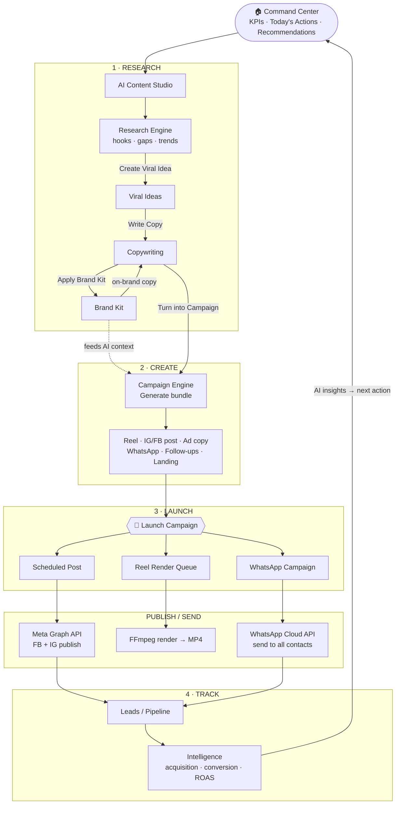
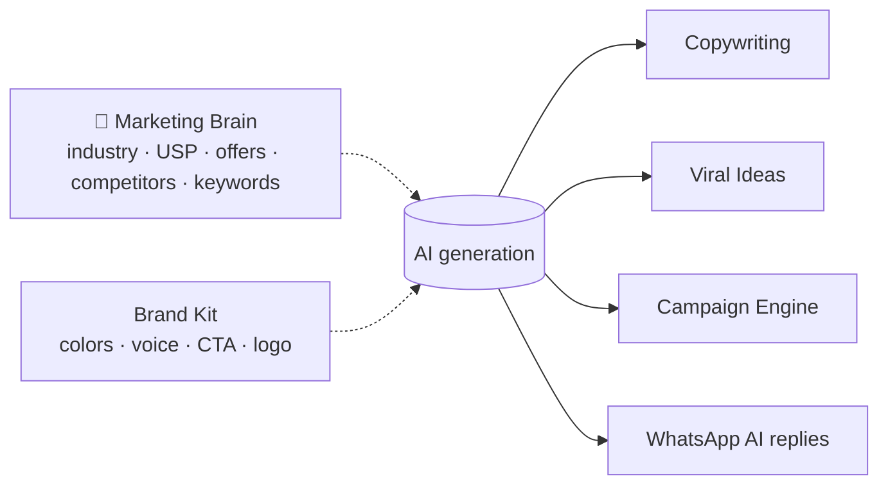
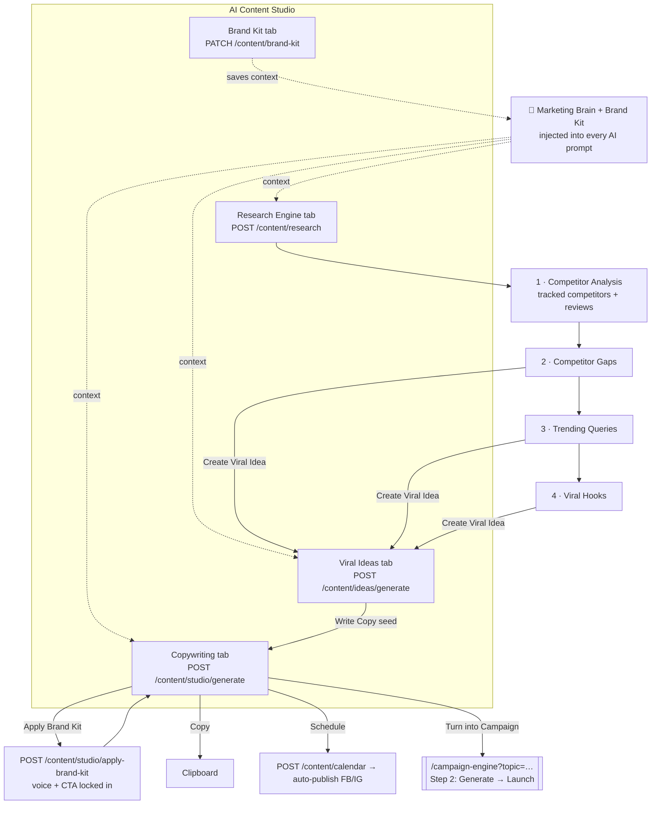

# App Flow Map — AI Marketing Operator

The complete user + data flow, from discovering an opportunity to tracking the result.

## The core loop



## Marketing Brain (context everywhere)



## Screen → API → outcome (reference table)

| Step | Screen | Key API | Outcome |
|---|---|---|---|
| — | Command Center | `GET /dashboard/command-center` | KPIs + Today's Actions + recommendations |
| 1a | Content Studio · Research | `POST /content/research` | Runs competitor analysis (tracked competitors + reviews + market gaps) first, then Gaps → Trends → Hooks; each card → **Create Viral Idea** |
| 1b | Content Studio · Ideas | `POST /content/ideas/generate` (accepts `seed`) | Ideas built on the seed; each card → **Write Copy** |
| 1c | Content Studio · Copy | `POST /content/studio/generate` | AI copy → **Apply Brand Kit** → Copy / Schedule / **Turn into Campaign** |
| 1d | Content Studio · Apply Brand Kit | `POST /content/studio/apply-brand-kit` | Rewrites copy in brand voice + injects signature CTA |
| — | Content Studio · Brand Kit | `PATCH /content/brand-kit` | Saved; the source of the brand voice/CTA applied above |
| — | Marketing Brain | `PATCH /content/business-profile` | Saved; feeds all AI |
| 2 | Campaign Engine | `POST /content/campaign-engine/generate` | Full campaign bundle |
| 3 | Campaign Engine | `POST /content/campaign-engine/launch` | Post scheduled + reel queued + WhatsApp sent |
| 3 | Content Calendar | scheduler cron | Auto-publish to FB/IG |
| 3 | Campaigns | `POST /campaigns/:id/send-now` | WhatsApp broadcast |
| 3 | Inbox | `POST /conversations/:id/messages` | Reply (+ AI suggest) |
| 4 | Pipeline | `GET /leads/pipeline` · `PATCH /leads/:id` | Drag to move stage |
| 4 | Intelligence | `GET /dashboard/intelligence` | Acquisition · conversion · revenue · ROAS |

## The one-line summary

> **Research → Create → Launch → Track**, with the **Marketing Brain** feeding every AI step and **Intelligence** feeding the next decision back into the Command Center.

---

## AI Content Studio — internal flow (Step 1 detail)

Content Studio has 4 tabs. Three produce content that flows onward to the Campaign
Engine; Brand Kit is the context source. The **Marketing Brain + Brand Kit** are
injected into every AI generation.



### Tab-by-tab (in workflow order)

| # | Tab | Input | Output | Onward action (chained) |
|---|---|---|---|---|
| 1 | **Research Engine** | topic, niche | Gaps → Trends → Hooks (+ history) | each card → **Create Viral Idea** (seeds Ideas tab) |
| 2 | **Viral Ideas** | niche (+ research seed) | 3 idea cards built on the seed | each card → **Write Copy** (seeds Copy tab) |
| 3 | **Copywriting** | topic (seeded), type, language, tone | caption / ad / hashtags / CTA / carousel | **Apply Brand Kit** → **Copy** · **Schedule** · **Turn into Campaign** |
| 4 | **Apply Brand Kit** (action on the copy) | generated copy | copy rewritten in brand voice + signature CTA | in-place update; then Turn into Campaign |
| — | **Brand Kit** (tab) | colors, voice, CTA, logo | saved brand kit | none — it *is* the source that Apply Brand Kit uses |

**Full ordered sequence** (the chained pipeline — each step feeds the next, no jumping to campaign until the copy exists):

```
Competitor Analysis → Competitor Gaps → Trending Queries → Viral Hooks
       │
       └─ Create Viral Idea ─▶ Viral Ideas
                                    │
                                    └─ Write Copy ─▶ Copywriting ─▶ Apply Brand Kit ─▶ Turn into Campaign → Launch

Brand Kit tab = where the voice/CTA/colors are saved; Apply Brand Kit uses them on the copy
```

- **Research** is the default tab. Generating a report runs a **competitor analysis**
  first — it reads the workspace's tracked competitors (Competitors tab), their real
  reviews, and any compiled market gaps, then grounds the report's **Competitor Gaps**
  in those real weaknesses (and derives Trends/Hooks from them).
- The report opens on a staged sub-sequence:
  **1 · Competitor Analysis → 2 · Competitor Gaps → 3 · Trending Queries → 4 · Viral Hooks**.
  Stage 1 shows which competitors were used (or prompts you to track some) and has a
  "Continue to Competitor Gaps" button before the rest.
- Competitors can be discovered **automatically by location**: the Competitors tab's
  "Auto-find by my location" button (`POST /competitors/auto-discover?autoTrack=true`)
  reads your industry + location from the Marketing Brain and auto-tracks the top
  local competitors — no manual search needed.
- A gap / trend / hook card does **not** jump to the campaign engine. It runs
  **Create Viral Idea**, which seeds the **Viral Ideas** tab (the seed is sent to
  `POST /content/ideas/generate` so the ideas develop that exact angle).
- A viral idea card runs **Write Copy**, which seeds the **Copywriting** tab's topic.
- After the copy is generated, **Apply Brand Kit** rewrites it in the saved brand
  voice and injects the signature CTA (`POST /content/studio/apply-brand-kit`).
- Only **Copywriting** exits to the Campaign Engine, via **Turn into Campaign**.
- **Brand Kit** is the tab where the voice/CTA/colors/logo are saved; it is the source
  that **Apply Brand Kit** draws from.

### The rule
The pipeline is **chained**: research angles create ideas, ideas create copy, and only
finished copy becomes a campaign. Each step seeds the next tab instead of scattering
"Turn into Campaign" buttons everywhere. **Turn into Campaign** lives only on
Copywriting; from there **Generate** builds the full bundle and **Launch** auto-schedules
the post, queues the reel render, and messages all contacts. Brand Kit doesn't flow
onward because its job is to shape *what* the AI produces.
