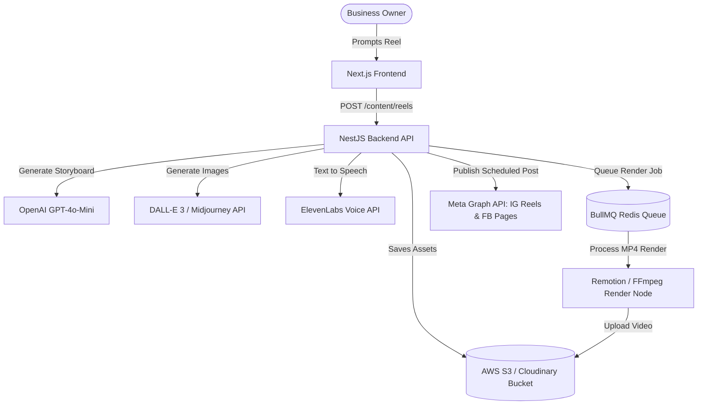

# AI Content & Communication OS: Production Integration Blueprint

This document outlines the end-to-end engineering architecture, service codebases, and deployment plans required to transition the simulated components of the **AI Content & Communication OS** into a fully dynamic, production-grade SaaS platform.



---

## 1. Cloud Asset Storage (AWS S3 & Cloudinary Integration)

Currently, assets are uploaded locally and videos return a static sample path. To make this fully dynamic, we must integrate an active cloud storage layer.

### Step A: Install SDKs
Install AWS SDK client and Cloudinary uploader packages on the NestJS backend:
```bash
pnpm --filter api add @aws-sdk/client-s3 @aws-sdk/s3-request-presigner
```

### Step B: Create Storage Service
Implement `apps/api/src/common/services/storage.service.ts` to support file streaming and pre-signed upload URLs:

```typescript
import { Injectable } from '@nestjs/common';
import { ConfigService } from '@nestjs/config';
import { S3Client, PutObjectCommand } from '@aws-sdk/client-s3';
import { getSignedUrl } from '@aws-sdk/s3-request-presigner';

@Injectable()
export class StorageService {
  private s3Client: S3Client;
  private bucketName: string;

  constructor(private config: ConfigService) {
    this.s3Client = new S3Client({
      region: this.config.getOrThrow('AWS_REGION'),
      credentials: {
        accessKeyId: this.config.getOrThrow('AWS_ACCESS_KEY_ID'),
        secretAccessKey: this.config.getOrThrow('AWS_SECRET_ACCESS_KEY'),
      },
    });
    this.bucketName = this.config.getOrThrow('AWS_S3_BUCKET_NAME');
  }

  async getPresignedUploadUrl(key: string, contentType: string): Promise<string> {
    const command = new PutObjectCommand({
      Bucket: this.bucketName,
      Key: key,
      ContentType: contentType,
    });
    return getSignedUrl(this.s3Client, command, { expiresIn: 3600 });
  }

  async uploadBuffer(buffer: Buffer, key: string, contentType: string): Promise<string> {
    await this.s3Client.send(
      new PutObjectCommand({
        Bucket: this.bucketName,
        Key: key,
        Body: buffer,
        ContentType: contentType,
      })
    );
    return `https://${this.bucketName}.s3.amazonaws.com/${key}`;
  }
}
```

---

## 2. Dynamic AI Video Narration (ElevenLabs Integration)

Currently, the custom voices are visual presets. Let's make the voiceovers fully dynamic by converting the AI scene scripts to realistic MP3 narrations.

### Step A: Create ElevenLabs Service
Implement `apps/api/src/content/services/elevenlabs.service.ts` to convert scene text to high-quality audio files:

```typescript
import { Injectable, HttpException, HttpStatus } from '@nestjs/common';
import { ConfigService } from '@nestjs/config';
import axios from 'axios';

@Injectable()
export class ElevenLabsService {
  private apiKey: string;

  constructor(private config: ConfigService) {
    this.apiKey = this.config.getOrThrow('ELEVENLABS_API_KEY');
  }

  async generateSpeech(text: string, voiceId: string): Promise<Buffer> {
    try {
      const response = await axios({
        method: 'POST',
        url: `https://api.elevenlabs.io/v1/text-to-speech/${voiceId}`,
        data: {
          text,
          model_id: 'eleven_monolingual_v1',
          voice_settings: { stability: 0.5, similarity_boost: 0.75 }
        },
        headers: {
          'xi-api-key': this.apiKey,
          'accept': 'audio/mpeg',
          'content-type': 'application/json'
        },
        responseType: 'arraybuffer'
      });

      return Buffer.from(response.data);
    } catch (error) {
      throw new HttpException(
        'ElevenLabs speech generation failed: ' + error.response?.data?.message || error.message,
        HttpStatus.BAD_GATEWAY
      );
    }
  }
}
```

---

## 3. Dynamic Visual Assets (DALL-E 3 / Midjourney API Integration)

Currently, the storyboard references stock photographs. To make this fully custom, we generate high-quality AI images automatically matching the storyboard scene descriptions.

### Step A: Implement DALL-E Service
Add image generation directly to `apps/api/src/ai/ai.service.ts`:

```typescript
async generateSceneImage(prompt: string): Promise<string> {
  if (!this.client) {
    throw new Error('OpenAI Client is not initialized.');
  }

  const response = await this.client.images.generate({
    model: 'dall-e-3',
    prompt: `Vertical 9:16 aspect ratio social media graphic. ${prompt}. High quality 8k render, modern styling, premium aesthetic. No text or typography inside the image.`,
    n: 1,
    size: '1024x1792', // Optimized vertical aspect ratio for mobile reels
    response_format: 'url',
  });

  return response.data[0].url; // Returns temporary S3 generation URL to download and save
}
```

---

## 4. Multi-Channel Publishing (Meta Graph API Integration)

Transition from writing database records to executing OAuth-authenticated publishes directly to Facebook Page Feeds and Instagram Reels.

### Step A: Extend Database Schema (`prisma/schema.prisma`)
Add storage for authorization tokens in the `SocialAccount` model:

```prisma
model SocialAccount {
  id              String   @id @default(uuid())
  workspaceId     String
  platform        String   // INSTAGRAM, FACEBOOK
  accountId       String   // Page/IG User ID
  accountName     String
  profilePicture  String?
  accessToken     String   // High-security OAuth Access Token
  refreshToken    String?  // Optional refresh token
  expiresAt       DateTime?
  createdAt       DateTime @default(now())
  updatedAt       DateTime @updatedAt

  workspace       Workspace @relation(fields: [workspaceId], references: [id], onDelete: Cascade)
}
```

### Step B: Implement Meta Publishing Service
Implement `apps/api/src/content/services/meta-publishing.service.ts`:

```typescript
import { Injectable, HttpException, HttpStatus } from '@nestjs/common';
import axios from 'axios';

@Injectable()
export class MetaPublishingService {
  
  /** Publish post to Facebook Page Feed */
  async publishToFacebookPage(pageId: string, accessToken: string, message: string, mediaUrl?: string) {
    try {
      const url = `https://graph.facebook.com/v19.0/${pageId}/${mediaUrl ? 'photos' : 'feed'}`;
      const payload: any = {
        message,
        access_token: accessToken,
      };
      if (mediaUrl) payload.url = mediaUrl;

      const res = await axios.post(url, payload);
      return res.data; // Returns post ID { id: "page_post_id" }
    } catch (err) {
      throw new HttpException('Meta Facebook publish failed: ' + err.response?.data?.error?.message || err.message, HttpStatus.BAD_GATEWAY);
    }
  }

  /** Publish a Video/Reel to Instagram (Two-step Meta Graph API flow) */
  async publishReelToInstagram(instagramUserId: string, accessToken: string, videoUrl: string, caption: string) {
    try {
      // 1. Create a media container for Reels
      const containerUrl = `https://graph.facebook.com/v19.0/${instagramUserId}/media`;
      const containerRes = await axios.post(containerUrl, {
        media_type: 'REELS',
        video_url: videoUrl,
        caption: caption,
        access_token: accessToken,
      });
      const containerId = containerRes.data.id;

      // 2. Poll container status until media is fully processed by Meta servers
      let isReady = false;
      const statusUrl = `https://graph.facebook.com/v19.0/${containerId}`;
      
      for (let i = 0; i < 12; i++) {
        await new Promise((resolve) => setTimeout(resolve, 5000)); // Poll every 5s
        const statusRes = await axios.get(statusUrl, { params: { fields: 'status_code', access_token: accessToken } });
        if (statusRes.data.status_code === 'FINISHED') {
          isReady = true;
          break;
        }
      }

      if (!isReady) throw new Error('Video processing on Instagram timed out.');

      // 3. Publish the media container live
      const publishUrl = `https://graph.facebook.com/v19.0/${instagramUserId}/media_publish`;
      const publishRes = await axios.post(publishUrl, {
        creation_id: containerId,
        access_token: accessToken,
      });

      return publishRes.data; // Returns media publish ID { id: "media_id" }
    } catch (err) {
      throw new HttpException('Meta Instagram publish failed: ' + err.response?.data?.error?.message || err.message, HttpStatus.BAD_GATEWAY);
    }
  }
}
```

---

## 5. Timeline Compilation & Rendering Node (Remotion Cluster)

Rather than running a mockup 3-second delay, configure a backend rendering pipeline that compiles images, transitions, subtitle animations, and voice narration into a high-fidelity MP4.

```
[Scenes Configuration JSON] + [Voiceover Narrations]
                       │
                       ▼
          [Remotion Webpack Bundle]
                       │
                       ▼
       [Docker Container / AWS Lambda Node]
                       │
                       ▼
        [FFmpeg Frame Splice Processor] ──> [Uploads Dynamic MP4 to AWS S3]
```

### Step A: Create Remotion Project
Initialize a Remotion project inside a dedicated directory `apps/video-generator`:
```bash
npx create-video@latest --template typescript apps/video-generator
```

Create a dynamic Composition `apps/video-generator/src/ReelComposition.tsx` which renders scene structures, voiceover audio, transitions, and styled subtitle layers in HTML/CSS:

```tsx
import { AbsoluteFill, Audio, Img, Sequence, useVideoConfig } from 'remotion';

interface Scene {
  text: string;
  imageUrl: string;
  duration: number;
  transition: 'fade' | 'slide' | 'pop';
  voiceoverUrl: string;
}

export const ReelComposition = ({ scenes }: { scenes: Scene[] }) => {
  let cumulativeFrame = 0;
  const { fps } = useVideoConfig();

  return (
    <AbsoluteFill className="bg-black">
      {scenes.map((scene, index) => {
        const startFrame = cumulativeFrame;
        const durationFrames = Math.round(scene.duration * fps);
        cumulativeFrame += durationFrames;

        return (
          <Sequence key={index} from={startFrame} durationInFrames={durationFrames}>
            {/* Visual Stock Image Render */}
            <AbsoluteFill className="overflow-hidden">
              
            </AbsoluteFill>

            {/* Narration Subtitle Layer */}
            <div className="absolute bottom-32 inset-x-12 text-center z-10">
              <p
                style={{
                  backgroundColor: '#facc15',
                  color: 'black',
                  fontWeight: 900,
                  fontSize: '2rem',
                  padding: '1.25rem',
                  borderRadius: '1rem',
                  display: 'inline-block',
                  textTransform: 'uppercase',
                  boxShadow: '0 10px 15px rgba(0,0,0,0.3)',
                }}
              >
                {scene.text}
              </p>
            </div>

            {/* Audio Voiceover Narrator */}
            <Audio src={scene.voiceoverUrl} />
          </Sequence>
        );
      })}
    </AbsoluteFill>
  );
};
```

### Step B: Build NestJS Compilation Worker
Create a queue processor in NestJS that executes CLI or Lambda-based Remotion builds when the "Compile Video" route is triggered:

```typescript
import { Process, Processor } from '@nestjs/bull';
import { Job } from 'bullmq';
import { exec } from 'child_process';
import { promisify } from 'util';
import { StorageService } from '../../common/services/storage.service';

const execAsync = promisify(exec);

@Processor('video-render-queue')
export class VideoRenderWorker {
  constructor(private storage: StorageService) {}

  @Process('render-job')
  async handleRender(job: Job<{ projectId: string; scenes: any[] }>) {
    const { projectId, scenes } = job.data;
    
    // 1. Write the dynamic scenes data to a temporary input.json
    const inputPath = `/tmp/input-${projectId}.json`;
    await fs.promises.writeFile(inputPath, JSON.stringify({ scenes }));

    // 2. Trigger the Remotion Lambda or Local Docker CLI build to bundle the MP4
    const outputPath = `/tmp/output-${projectId}.mp4`;
    const compileCmd = `npx remotion render src/index.ts ReelComposition ${outputPath} --props=${inputPath}`;
    
    await execAsync(compileCmd);

    // 3. Upload compiled vertical MP4 to secure S3 storage bucket
    const videoBuffer = await fs.promises.readFile(outputPath);
    const cloudUrl = await this.storage.uploadBuffer(videoBuffer, `reels/${projectId}.mp4`, 'video/mp4');

    // 4. Update the DB record status to COMPLETED and return the cloud URL
    await this.prisma.reelProject.update({
      where: { id: projectId },
      data: { videoUrl: cloudUrl, status: 'COMPLETED' }
    });

    // 5. Clean up temporary local files
    await Promise.all([fs.promises.unlink(inputPath), fs.promises.unlink(outputPath)]);
  }
}
```

---

## 6. Next Steps: Production Verification Plan

To verify that these live components function perfectly in production:

1. **Verify ElevenLabs Audios**: Verify speech generation with simple cURL endpoints testing English/Hinglish translations.
2. **Meta Developer OAuth Sandbox**: Set up a Sandbox App in Meta Business Manager, adding test Instagram Professional/Creator account IDs to perform end-to-end sandbox Reel uploads.
3. **AWS S3 CORS Config**: Verify that your S3 Bucket has appropriate CORS rules to let Next.js frames play video files without browser blockers.
